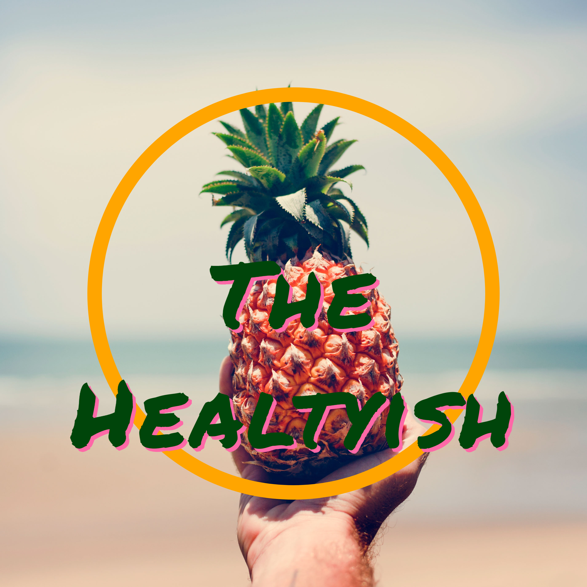
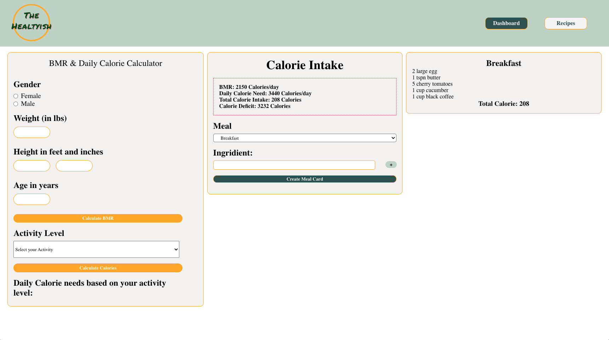

# The Healtyish
<div align="center">

</div>


## About The Healtyish
This is a calorie tracking app that allows you to calculate your BMR, Daily Calorie Needs based on your acticity level, your total calorie intake based on your meals and calorie deficit. Also, it gives you an opportunity to search some healty recipes according to food you have.

Powered by React on the frontend and NodeJs an the backend.

##Screenshot
<div align="center">
    
</div>

## Installation

After cloning the repos for client and server side, 
the packages on both the server and client folders need to be installed.

```zsh
  cd TheHealtyish/ && npm install
  npm start
```
on a seperate CLI

```zsh
  cd TheHealtyishAPI/ && npm install 
  npm run dev
```

nodemon is installed as a dev dependency to prevent the need to restart
the server with every change.

sample .env files can be used as a reference of the variables needed for
full functionality.

## Tech Stack

Libraries used in the making of frontend: 

●	React

●	React-Router

●	Sass

●	Uuid

●	Axios 

Libraries used in the making of backend:

●	Express

●	Uuid

●	Express-session

●	Cors

●	Dotenv

The project also depends on external APIs. Please check <a>https://www.edamam.com/</a> 


## Next Phases

Phase 2

•	Give Users extra powers like see/search history through a calander. 

•	Have a relational database to keep all users data. 

•	Make the website more responsive and have better UX design.

•   Add Authorization/Authentication.

•	Allow users to change their passwords and have email confirmation for forgotten passwords.

•	A feedback form for potential problems and solutions.

Phase 3

• Convert it to mobile app with React Native.	
